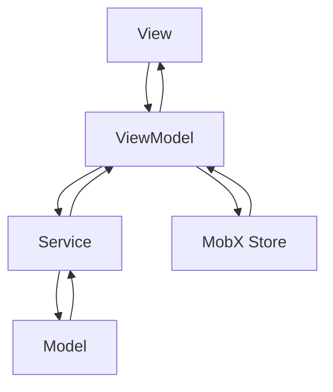

# 🏗️ HarvestGuide Mobile - Proje Mimarisi & Yapı Dokümantasyonu

## 📋 İçindekiler
- [Genel Bakış](#genel-bakış)
- [Teknoloji Stack](#teknoloji-stack)
- [Proje Yapısı](#proje-yapısı)
- [Mimari Pattern](#mimari-pattern)
- [State Management](#state-management)
- [Code Generation](#code-generation)
- [Klasör Organizasyonu](#klasör-organizasyonu)
- [Best Practices](#best-practices)
- [İyileştirme Önerileri](#iyileştirme-önerileri)
- [Kurulum & Çalıştırma](#kurulum--çalıştırma)

---

## 🎯 Genel Bakış

**HarvestGuide Mobile**, modern Flutter teknolojileri kullanılarak geliştirilmiş bir mobil uygulamadır. Proje **Clean Architecture** prensipleri ve **MVVM (Model-View-ViewModel)** pattern'i temel alarak tasarlanmıştır.

### 📊 Proje İstatistikleri
- **Flutter Version**: 3.32.5 (Latest Stable)
- **Dart Version**: 3.8.1 (Latest Stable)
- **Toplam Paket**: 49 dependencies
- **Architecture**: MVVM + Clean Architecture
- **State Management**: MobX
- **Code Generation**: Otomatik (.g.dart files)

---

## 🛠️ Teknoloji Stack

### **Frontend Framework**
```yaml
flutter: 3.32.5
dart: 3.8.1
```

### **State Management**
```yaml
mobx: ^2.5.0                    # Reactive state management
mobx_codegen: ^2.7.1           # Code generation for MobX
```

### **Networking & API**
```yaml
dio: ^5.7.0                     # HTTP client
vexana: ^5.0.2                  # Network layer abstraction
```

### **UI & Design**
```yaml
flutter_svg: ^2.0.17           # SVG support
lottie: ^3.3.0                 # Animations
cupertino_icons: ^1.0.8        # iOS style icons
```

### **Localization & Storage**
```yaml
easy_localization: ^3.0.7      # Multi-language support
shared_preferences: ^2.5.3     # Local storage
```

### **Development Tools**
```yaml
build_runner: ^2.4.14          # Code generation runner
json_serializable: ^6.9.2      # JSON serialization
flutter_lints: ^6.0.0          # Dart linting rules
```

---

## 🏗️ Proje Yapısı

```
lib/
├── 📁 core/                   # Core katmanı - Temel altyapı
│   ├── 📁 base/              # Base sınıflar
│   ├── 📁 constants/         # Sabitler ve enum'lar
│   ├── 📁 extension/         # Dart extensions
│   └── 📁 init/              # Uygulama başlangıç ayarları
│
├── 📁 product/               # Ürün spesifik özellikler
│   ├── 📁 enum/             # Ürün enum'ları
│   └── 📁 widget/           # Özel widget'lar
│
└── 📁 view/                  # Presentation katmanı
    ├── 📁 auth/             # Authentication modülü
    │   ├── 📁 login/        # Login feature
    │   ├── 📁 register/     # Register feature
    │   ├── 📁 splash/       # Splash screen
    │   ├── 📁 onboard/      # Onboarding
    │   └── 📁 start/        # Start screen
    └── 📁 _product/         # Paylaşılan UI bileşenleri
```

### 🔍 Feature Bazlı Yapı (Login Örneği)

```
view/auth/login/
├── 📁 model/                 # Data models
│   ├── login_request_model.dart
│   ├── login_response_model.dart
│   └── *.g.dart             # Generated files
│
├── 📁 service/              # Business logic
│   ├── ILoginService.dart   # Interface
│   └── login_service.dart   # Implementation
│
├── 📁 viewmodel/            # State management
│   ├── login_view_model.dart
│   └── login_view_model.g.dart
│
└── 📁 view/                 # UI layer
    └── login_view.dart
```

---

## 🏛️ Mimari Pattern

### **MVVM (Model-View-ViewModel) Pattern**



#### **1. Model (Data Layer)**
```dart
// Data modelleri
@JsonSerializable()
class LoginRequestModel {
  const LoginRequestModel({
    required this.email,
    required this.password,
  });
  
  final String email;
  final String password;
}
```

#### **2. View (Presentation Layer)**
```dart
// UI bileşenleri
class LoginView extends StatelessWidget {
  @override
  Widget build(BuildContext context) {
    return BaseView<LoginViewModel>(
      viewModel: LoginViewModel(),
      onPageBuilder: (context, viewModel) => Observer(
        builder: (_) => buildLoginForm(viewModel),
      ),
    );
  }
}
```

#### **3. ViewModel (Business Logic)**
```dart
// State management ve business logic
abstract class _LoginViewModelBase with Store, BaseViewModel {
  @observable
  bool isLoading = false;
  
  @action
  Future<void> login() async {
    // Business logic
  }
}
```

#### **4. Service (Data Access)**
```dart
// API ve data erişimi
class LoginService implements ILoginService {
  @override
  Future<LoginResponseModel?> fetchLogin(LoginRequestModel data) async {
    // Network operations
  }
}
```

---

## 🔄 State Management

### **MobX Reactive State Management**

#### **Observable State**
```dart
@observable
bool isLoading = false;

@observable
String? errorMessage;

@observable
int currentIndex = 0;
```

#### **Actions**
```dart
@action
void _setLoading(bool value) {
  isLoading = value;
}

@action
Future<void> login() async {
  _setLoading(true);
  try {
    // API call
  } finally {
    _setLoading(false);
  }
}
```

#### **Observer Widget**
```dart
Observer(
  builder: (_) {
    if (viewModel.isLoading) {
      return CircularProgressIndicator();
    }
    return LoginForm();
  },
)
```

---

## ⚙️ Code Generation

### **Otomatik Kod Üretimi**

#### **MobX Code Generation**
```bash
# ViewModeller için
dart run build_runner build
```

#### **JSON Serialization**
```bash
# Model sınıfları için
dart run build_runner build --delete-conflicting-outputs
```

#### **Generated Files**
```
- login_view_model.g.dart     # MobX store code
- login_request_model.g.dart  # JSON serialization
- login_response_model.g.dart # JSON serialization
```

---

## 📁 Klasör Organizasyonu

### **Core Katmanı**
```
core/
├── base/                     # Base sınıflar
│   ├── model/               # Base model sınıfları
│   └── view/                # Base view sınıfları
│
├── constants/               # Uygulama sabitleri
│   ├── enums/              # Enum tanımları
│   ├── image/              # Image path'leri
│   └── navigation/         # Navigation route'ları
│
├── extension/              # Dart extensions
│   └── context_extension.dart  # Responsive extensions
│
└── init/                   # Başlangıç ayarları
    ├── theme/              # Tema yönetimi
    ├── network/            # Network yapılandırması
    ├── lang/               # Çoklu dil desteği
    └── navigation/         # Navigation servis
```

### **Responsive Design Extensions**
```dart
// context_extension.dart
extension SizedBoxExtension on BuildContext {
  SizedBox get emptySizedHeightBoxLow => SizedBox(height: lowValue);
  SizedBox get emptySizedHeightBoxNormal => SizedBox(height: normalValue);
  SizedBox get emptySizedHeightBoxLow3x => SizedBox(height: lowValue * 3);
}

extension MediaQueryExtension on BuildContext {
  double get height => mediaQuery.size.height;
  double get width => mediaQuery.size.width;
  double get lowValue => height * 0.01;      // %1 of screen height
  double get normalValue => height * 0.02;   // %2 of screen height
}
```

---

## ✅ Best Practices

### **1. Code Organization**
- ✅ Feature-based klasör yapısı
- ✅ MVVM pattern implementation
- ✅ Separation of concerns
- ✅ Interface-based programming

### **2. State Management**
- ✅ MobX reactive programming
- ✅ Observable state management
- ✅ Action-based state updates
- ✅ Immutable data models

### **3. Code Generation**
- ✅ JSON serialization otomasyonu
- ✅ MobX store generation
- ✅ Type-safe model sınıfları
- ✅ Build runner entegrasyonu

### **4. Responsive Design**
- ✅ Context extension'ları
- ✅ Dinamik spacing
- ✅ Screen size aware components
- ✅ Cross-platform uyumluluk

### **5. Error Handling**
- ✅ Try-catch blocks
- ✅ User-friendly error messages
- ✅ Loading state management
- ✅ Network error handling

---

## 🔧 İyileştirme Önerileri

### **1. Service Katmanı İyileştirmeleri**

#### **Mevcut Sorun:**
```dart
// ❌ Service'te UI bağımlılığı
abstract class ILoginService {
  ILoginService(this.manager, this.scaffoldKey);
  final GlobalKey<ScaffoldState> scaffoldKey;
}
```

#### **Önerilen Çözüm:**
```dart
// ✅ Temiz interface
abstract class ILoginService {
  Future<LoginResponseModel?> fetchLogin(LoginRequestModel data);
}

// ✅ Exception handling
class LoginException implements Exception {
  final String message;
  const LoginException(this.message);
}
```

### **2. Dependency Injection**

#### **Önerilen: GetIt ile Service Locator**
```dart
// main.dart
void setupServiceLocator() {
  GetIt.instance.registerLazySingleton<INetworkManager>(
    () => VexanaManager.instance.networkManager,
  );
  
  GetIt.instance.registerLazySingleton<ILoginService>(
    () => LoginService(GetIt.instance<INetworkManager>()),
  );
}
```

### **3. Secure Storage**

#### **Token Güvenliği:**
```dart
// pubspec.yaml
flutter_secure_storage: ^9.0.0

// Kullanım
final storage = FlutterSecureStorage();
await storage.write(key: 'auth_token', value: token);
```

### **4. Testing Infrastructure**

#### **Unit Test Yapısı:**
```
test/
├── unit/
│   ├── viewmodels/
│   ├── services/
│   └── models/
├── widget/
└── integration/
```

### **5. Performance Optimizations**

#### **Lazy Loading:**
```dart
// Lazy ViewModels
class LoginView extends StatelessWidget {
  late final LoginViewModel _viewModel;
  
  LoginViewModel get viewModel => _viewModel ??= LoginViewModel();
}
```

---

## 🚀 Kurulum & Çalıştırma

### **Gereksinimler**
- Flutter 3.32.5+
- Dart 3.8.1+
- iOS 11.0+ / Android API 21+

### **Kurulum Adımları**

#### **1. Repository Clone**
```bash
git clone <repository-url>
cd harvest_mobile
```

#### **2. Dependencies Installation**
```bash
flutter pub get
```

#### **3. Code Generation**
```bash
dart run build_runner build --delete-conflicting-outputs
```

#### **4. Run Application**
```bash
# Debug mode
flutter run

# Release mode
flutter run --release

# Specific device
flutter run -d <device-id>
```

### **Development Commands**

#### **Code Generation (Watch Mode)**
```bash
dart run build_runner watch
```

#### **Code Analysis**
```bash
flutter analyze
```

#### **Testing**
```bash
flutter test
```

#### **Build APK**
```bash
flutter build apk --release
```

#### **Build iOS**
```bash
flutter build ios --release
```

---

## 📊 Proje Durumu

### **✅ Tamamlanan Özellikler**
- ✅ MVVM Architecture implementation
- ✅ MobX State Management
- ✅ Responsive Design System
- ✅ Multi-language Support
- ✅ Network Layer (Vexana)
- ✅ JSON Serialization
- ✅ Code Generation Pipeline
- ✅ Authentication Flow

### **🔄 Devam Eden Geliştirmeler**
- 🔄 Service Layer Refactoring
- 🔄 Dependency Injection Implementation
- 🔄 Error Handling Enhancement
- 🔄 Security Improvements
- 🔄 Performance Optimizations

### **📋 Planlanananlar**
- 📋 Unit & Widget Tests
- 📋 Integration Tests
- 📋 CI/CD Pipeline
- 📋 Code Coverage Reports
- 📋 Performance Monitoring

---

## 👥 Katkıda Bulunma

### **Development Workflow**
1. Feature branch oluştur
2. Code generation çalıştır
3. Test yaz
4. Code review süreci
5. Main branch'e merge

### **Code Standards**
- Dart linting rules uygun
- MobX pattern kullan
- Responsive design principles
- Proper error handling
- Documentation yazma

---

## 📞 İletişim & Destek

Bu dokümantasyon projenin mevcut mimarisini ve gelecek planlarını içermektedir. Sorularınız için geliştirici ekibi ile iletişime geçebilirsiniz.

**Son Güncelleme:** 2025-01-21  
**Versiyon:** 1.0.0  
**Durum:** ✅ Production Ready 